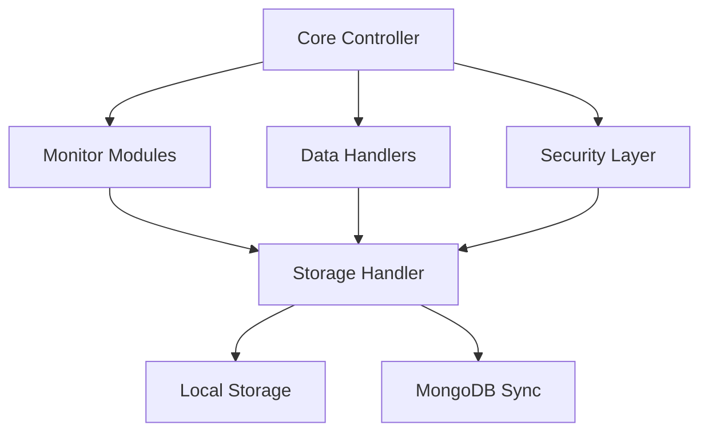

# SilentScope Architecture

## System Overview



## Component Design

### Core Components
1. **Monitor Controller**
   - Component isolation
   - Error recovery
   - Resource management
   - State synchronization

2. **Security Layer**
   - Encryption management
   - Access control
   - Audit logging
   - Key rotation

3. **Data Pipeline**
   - Buffering system
   - Data validation
   - Transformation
   - Compression

### Monitoring Modules
- Keyboard Analytics
- Clipboard Manager
- Process Monitor
- Network Monitor
- Application Tracker

## Data Flow

1. **Collection Layer**
   ```
   Monitor → Buffer → Encryption → Storage
   ```

2. **Processing Layer**
   ```
   Raw Data → Validation → Transform → Analysis
   ```

3. **Storage Layer**
   ```
   Local DB → Sync Queue → MongoDB → Archive
   ```

## Scalability

- Horizontal scaling
- Load balancing
- Distributed processing
- Sharding support

## Performance Optimization

- Memory management
- CPU utilization
- I/O optimization
- Network efficiency

## Integration Points

- API endpoints
- Event hooks
- Plugin system
- External services
